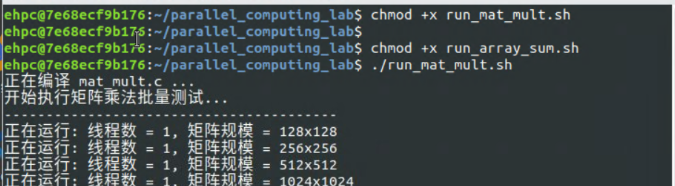
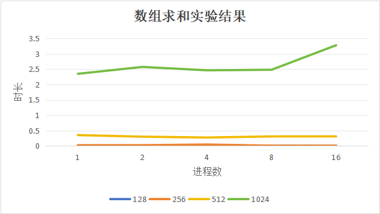
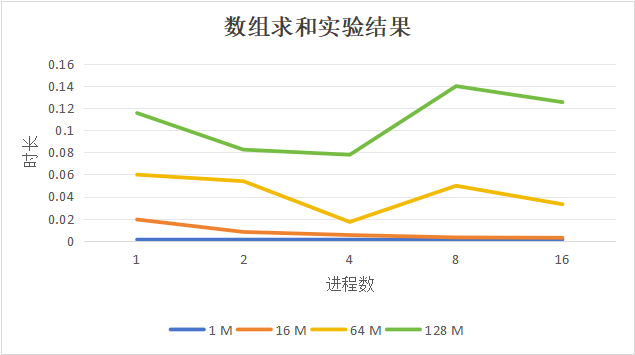

# 中山大学计算机学院本科生实验报告

**（2026学年春季学期）**

**课程名称：** 并行程序设计       **批改人：**

| **实验**  | **3-Pthreads并行矩阵乘法与数组求和** | **专业（方向）** | 计算机科学与技术 |
| --------- | ------------------------------------ | ---------------- | ---------------- |
| **学号**  | 22345020                             | **姓名**         | 丁烁芝           |
| **Email** | dingshzh5@mail2.sysu.edu.cn          | **完成日期**     | 2026年4月22日    |


------

### 1. 实验目的（200字以内）

本实验旨在通过具体编程实践，掌握基于Pthreads的多线程并行程序设计方法 。主要包含两个任务：一是实现并行矩阵乘法，分析不同矩阵规模（128-2048）和不同线程数（1-16）下的程序并行性能及可扩展性 ；二是实现并行数组求和（规模1M-128M），通过实践多线程创建，分析不同线程数量对并行效率的影响 。


### 2. 实验过程和核心代码（600字以内，图文并茂）

#### 2.1 实验环境准备

- **操作系统平台：** Linux、easyhpc云主机
- **编译器：** GCC
- **依赖库：** POSIX Threads (`pthread`) 用于实现多线程，`sys/time.h` 用于高精度计时。
- **编译指令：** `gcc -g -Wall -O2 -o target_name source.c -lpthread`

#### 2.2 核心代码实现与优化

**（1）并行矩阵乘法实现**

矩阵乘法采用**按行块划分（Row Block Partitioning）**的策略进行任务分配。假设有 $p$ 个线程，矩阵 $C$ 总共有 $m$ 行，则每个线程平均负责计算约 $m/p$ 行的数据。为了处理无法整除的情况，将剩余的行全部分配给最后一个线程处理。这种划分方式保证了各线程独立写入不同的内存地址，无需使用互斥锁，避免了同步开销。

```C
// 矩阵乘法核心线程函数
void* Pth_mat_mult(void* rank) {
    long my_rank = (long) rank;
    int local_m = m / thread_count; 
    int my_first_row = my_rank * local_m;
    int my_last_row = (my_rank + 1) * local_m - 1;
    if (my_rank == thread_count - 1) my_last_row = m - 1; // 最后一个线程处理余数

    for (int i = my_first_row; i <= my_last_row; i++) {
        for (int j = 0; j < k; j++) {
            C[i][j] = 0.0;
            for (int x = 0; x < n; x++) C[i][j] += A[i][x] * B[x][j];
        }
    }
    return NULL;
}
```

**（2）并行数组求和及优化**

数组求和同样采用均匀的数据块划分。由于所有线程最终需要将结果累加到一个全局变量 `global_sum` 中，如果每次加法都使用互斥锁（`pthread_mutex_lock`），会导致严重的锁竞争和伪共享问题。

**优化策略：** 采用“局部变量求和，再全局聚合”的方法。每个线程先用一个局部变量 `my_sum` 计算自己负责的数据块的总和，计算完成后，仅在最后一步使用互斥锁将局部和安全地累加到全局变量中。这使得加锁次数从 $n$ 次大幅降低到 $p$ 次。

```C
// 数组求和核心线程函数 (局部和优化)
void* Pth_sum(void* rank) {
    // ... (边界计算逻辑同上)
    long long my_sum = 0; // 使用局部变量
    for (long long i = my_first_i; i <= my_last_i; i++) {
        my_sum += A[i];
    }
    // 仅在最后合并结果时加锁
    pthread_mutex_lock(&mutex);
    global_sum += my_sum;
    pthread_mutex_unlock(&mutex);
    return NULL;
}
```

### 3. 实验结果（500字以内，图文并茂）

运行脚本程序：、

#### 3.1 矩阵乘法实验结果

通过运行并行矩阵乘法程序，不同矩阵规模与进程（线程）数下的耗时（单位：秒）统计如下表所示：

| **进程数 \ 矩阵规模** | **128** | **256** | **512** | **1024** | **2048** |
| --------------------- | ------- | ------- | ------- | -------- | -------- |
| **1**                 | 0.0027  | 0.0217  | 0.3510  | 2.3483   | 75.9978  |
| **2**                 | 0.0016  | 0.0123  | 0.2990  | 2.5723   | 81.7800  |
| **4**                 | 0.0008  | 0.0435  | 0.2718  | 2.4618   | 73.8705  |
| **8**                 | 0.0142  | 0.0061  | 0.3073  | 2.4798   | 71.7235  |
| **16**                | 0.0032  | 0.0055  | 0.3084  | 3.2786   | 74.0301  |



**性能分析：** 以最大规模 `2048x2048` 为例，单线程耗时约为 76 秒。当线程数增加到 4 和 8 时，耗时略微下降至 71-73 秒左右，存在一定的加速效果。但整体加速比并不呈线性，并行效率随线程数增加而显著下降。原因分析如下：矩阵乘法具有极高的访存密集度，在多线程同时读取矩阵数据时，**内存带宽（Memory Bandwidth）极易成为瓶颈**；此外，如果测试机器的物理核心数不足（如仅有4核），过多的线程（如8线程、16线程）会导致频繁的上下文切换开销，抵消了并行的收益。

#### 3.2 数组求和实验结果

使用局部求和优化的并行数组程序，耗时（单位：秒）测试结果如下表：

| **进程数 \ 数组规模** | **1 M** | **16 M** | **64 M** | **128 M** |
| --------------------- | ------- | -------- | -------- | --------- |
| **1**                 | 0.00095 | 0.01918  | 0.05980  | 0.11567   |
| **2**                 | 0.00059 | 0.00789  | 0.05390  | 0.08249   |
| **4**                 | 0.00056 | 0.00509  | 0.01697  | 0.07784   |
| **8**                 | 0.00043 | 0.00294  | 0.04976  | 0.14005   |
| **16**                | 0.00068 | 0.00262  | 0.03300  | 0.12552   |



**性能分析：**

在 `128 M` 大规模数组下，从 1 线程（0.115s）扩展到 4 线程（0.077s）时，程序体现出了较好的加速比（约 1.48倍）。因为采用了“局部变量求和，最后全局合并”的聚合优化策略，大大降低了锁的竞争。但是当线程数达到 8 和 16 时，由于计算任务本身极其简单（仅为一次加法），线程创建、销毁及同步的开销已经大于计算均分带来的收益，从而出现了性能不升反降的现象（扩展性受限）。


### 4. 实验感想（200字以内）

本次实验让我对“并行加速”有了更真实的认知。初以为线程数越多程序越快，但实测发现，矩阵乘法在扩展到多线程后加速比逐渐停滞，原因是它作为访存密集型任务，极易触碰硬件内存带宽的瓶颈；在数组求和中，当线程达16时耗时反而上升，这是因计算任务过轻，线程创建与调度的系统开销远超并行带来的收益。这让我深刻明白，优秀的并行设计绝非盲目堆砌线程，而是必须综合权衡任务粒度、硬件架构（如缓存与总线带宽）与通信开销，才能实现真正的性能提升。