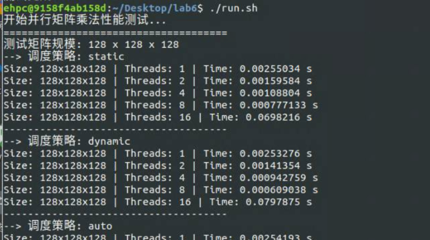
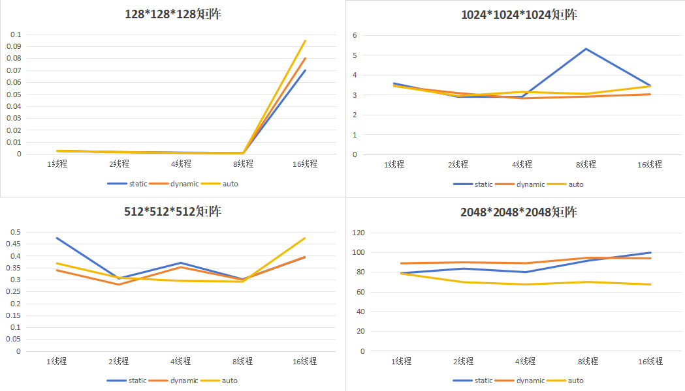

# 中山大学计算机院本科生实验报告

## （2026学年春季学期）

课程名称：并行程序设计         批改人：

| 实验  |                             | 专业（方向） | 计算机科学与技术 |
| ----- | --------------------------- | ------------ | ---------------- |
| 学号  | 22345020                    | 姓名         | 丁烁芝           |
| Email | dingshzh5@mail2.sysu.edu.cn | 完成日期     | 2026/            |

# 1. 实验目的

本实验旨在深入了解多核环境下的并行计算原理，使用OpenMP实现并行的通用矩阵乘法。根据实验要求，输入 $m, n, k$ 三个取值范围在 $[128, 2048]$ 的整数，生成相应的矩阵 $A$ 和 $B$ 并计算矩阵 $C$。通过设置不同的线程数量（1-16）、矩阵规模（128-2048）以及调度模式（默认、静态、动态），定量分析多线程对程序并行性能的实际影响，并借此理解底层内存局部性、线程管理开销与实际加速比之间的关联。 

# 2. 实验过程和核心代码

## 2.1 实验环境准备

实验在Linux系统环境下进行，通过Bash脚本实现编译与自动测试。编译时采用 `g++ -O3 -fopenmp omp_matmul.cpp -o omp_matmul` 指令，开启了最高级别的编译器优化并启用了OpenMP支持。为了全面评估不同调度策略，脚本通过动态修改 `OMP_SCHEDULE` 环境变量，依次测试了 `static`、`dynamic` 以及 `auto` 三种调度方式，并遍历了设定好的矩阵规模和线程数参数。

## 2.2 核心代码实现与优化

在内存管理层面，代码选择使用一维的 `std::vector<float>` 来模拟二维矩阵，使得数据在内存中能够保持物理连续。这种设计极大提升了空间局部性，有效提高了CPU Cache的命中率，这是计算密集型任务优化的关键一步。

在并行化层面，核心利用了 OpenMP 的预处理指令进行循环级别的任务划分：

```C++
#pragma omp parallel for default(none) shared(A, B, C, m, n, k)
for (int i = 0; i < m; ++i) {
    // 矩阵乘法内层逻辑...
}
```

该指令将最外层循环的迭代空间划分给多个线程执行。通过将变量设置为 `shared`，避免了内存的无谓拷贝，同时每个线程对矩阵 $C$ 写入的行索引 $i$ 各不相同，天然避免了数据竞争（Data Race）与伪共享（False Sharing）问题，保证了计算的正确性与高并发效率。

运行程序：




# 3. 实验结果

实验结果如下：

| **矩阵规模 (Size)**    | **调度策略 (Schedule)** | **1线程** | **2线程** | **4线程** | **8线程** | **16线程** |
| ---------------------- | ----------------------- | --------- | --------- | --------- | --------- | ---------- |
| **128 x 128 x 128**    | static                  | 0.00255   | 0.00159   | 0.00108   | 0.00077   | 0.06982    |
|                        | dynamic                 | 0.00253   | 0.00141   | 0.00094   | 0.00060   | 0.07978    |
|                        | auto                    | 0.00254   | 0.00156   | 0.00083   | 0.00068   | 0.09445    |
| **512 x 512 x 512**    | static                  | 0.47446   | 0.30459   | 0.37027   | 0.30128   | 0.39326    |
|                        | dynamic                 | 0.33896   | 0.27892   | 0.35201   | 0.29946   | 0.39499    |
|                        | auto                    | 0.36801   | 0.30795   | 0.29428   | 0.29125   | 0.47365    |
| **1024 x 1024 x 1024** | static                  | 3.57006   | 2.89543   | 2.89350   | 5.31038   | 3.46406    |
|                        | dynamic                 | 3.43341   | 3.08397   | 2.81902   | 2.90684   | 3.02249    |
|                        | auto                    | 3.45053   | 2.94017   | 3.14364   | 3.04733   | 3.42241    |
| **2048 x 2048 x 2048** | static                  | 78.7450   | 83.4063   | 79.8158   | 91.4588   | 99.5654    |
|                        | dynamic                 | 88.7424   | 89.7260   | 88.8473   | 94.3675   | 93.8434    |
|                        | auto                    | 78.3317   | 69.6244   | 67.3877   | 69.8482   | 67.3741    |



根据自动化脚本跑出的耗时数据，多线程和调度策略的性能表现呈现出非常明显的规律：

- **小规模矩阵（$128 \times 128 \times 128$）：**

  单线程表现最佳（约 0.0025s），随着线程数增加，性能不升反降，16线程时甚至激增至约 0.07-0.09s。这是因为在计算量极小的情况下，Pthreads底层进行线程创建、上下文切换和销毁的开销远远超过了并行计算所节约的时间。

- **中等规模矩阵（$512$ 与 $1024$ 级别）：**

  多线程的加速效果开始显现，但并非线性递增。以 $1024 \times 1024 \times 1024$ 为例，4线程时的性能较好（耗时约 2.8s - 3.1s）。当线程数继续攀升至16时，耗时未进一步下降反而小幅回升，说明此时遇到了内存带宽瓶颈，且缓存一致性同步的开销开始抵消并行收益。

- **大规模矩阵（$2048 \times 2048 \times 2048$）：**

  当计算密集度足够高时，并行的威力彻底释放。不同调度策略在此刻拉开差距：静态（`static`）与动态（`dynamic`）调度在多线程下的耗时通常在 78s-99s 之间波动；而 `auto` 调度表现出了惊人的稳定性与高效性，在 4、8、16 线程下均将耗时压降至 67s-69s 左右。这说明在复杂的系统资源环境下，由运行时或编译器自适应决定的调度策略能更好地平衡各个核心的负载。

  

# 4. 实验感想

本次实验让我直观地印证了“并非线程越多越快”的并发定律。这其实与我此前在编写操作系统微内核中断处理逻辑以及设计MIPS编译器后端的指令调度时有着异曲同工的体会：软件层面的并发设计如果脱离了底层硬件架构（如缓存一致性协议、总线带宽等），就无法达到真正的性能榨取。在测试过程中排查小矩阵的“负优化”现象时，我结合了AI辅助工程工具快速比对分析了测试日志，定位了线程开销的问题。未来在处理高并发系统级开发时，我会更加注重计算访存比（Roofline模型），从软硬协同的角度去思考系统优化。

 
