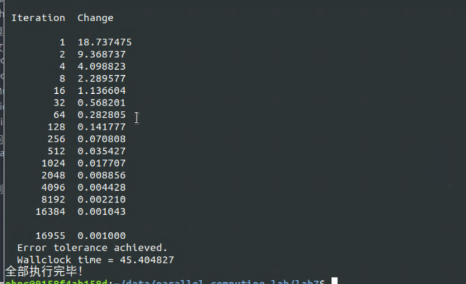

```
bash build_and_run.sh
=== 1. 编译 parallel_for 动态链接库 ===
动态链接库 libparallel_for.so 生成成功！
=== 2. 编译测试程序 ===
编译成功！
=== 3. 运行矩阵乘法正确性验证 ===
Starting Parallel Matrix Multiplication (500x500)...
Result C[0][0] = 1000.000000 (Expected: 1000.000000)
=== 4. 运行 Heated Plate 对比测试 ===
--- 运行 OpenMP 版本 ---

HEATED_PLATE_OPENMP
  C/OpenMP version
  A program to solve for the steady state temperature distribution
  over a rectangular plate.

  Spatial grid of 500 by 500 points.
  The iteration will be repeated until the change is <= 1.000000e-03
  Number of processors available = 16
  Number of threads =              16

  MEAN = 74.949900

 Iteration  Change

         1  18.737475
         2  9.368737
         4  4.098823
         8  2.289577
        16  1.136604
        32  0.568201
        64  0.282805
       128  0.141777
       256  0.070808
       512  0.035427
      1024  0.017707
      2048  0.008856
      4096  0.004428
      8192  0.002210
     16384  0.001043

     16955  0.001000

  Error tolerance achieved.
  Wallclock time = 2373.900026

HEATED_PLATE_OPENMP:
  Normal end of execution.
--- 运行 Pthreads 版本 (Threads: 1) ---

HEATED_PLATE_PTHREADS
  Spatial grid of 500 by 500 points.
  Number of threads = 1

  MEAN = 74.949900

 Iteration  Change

         1  18.737475
         2  9.368737
         4  4.098823
         8  2.289577
        16  1.136604
        32  0.568201
        64  0.282805
       128  0.141777
       256  0.070808
       512  0.035427
      1024  0.017707
      2048  0.008856
      4096  0.004428
      8192  0.002210
     16384  0.001043

     16955  0.001000
  Error tolerance achieved.
  Wallclock time = 22.112443
--- 运行 Pthreads 版本 (Threads: 2) ---

HEATED_PLATE_PTHREADS
  Spatial grid of 500 by 500 points.
  Number of threads = 2

  MEAN = 74.949900

 Iteration  Change

         1  18.737475
         2  9.368737
         4  4.098823
         8  2.289577
        16  1.136604
        32  0.568201
        64  0.282805
       128  0.141777
       256  0.070808
       512  0.035427
      1024  0.017707
      2048  0.008856
      4096  0.004428
      8192  0.002210
     16384  0.001043

     16955  0.001000
  Error tolerance achieved.
  Wallclock time = 20.991637
--- 运行 Pthreads 版本 (Threads: 4) ---

HEATED_PLATE_PTHREADS
  Spatial grid of 500 by 500 points.
  Number of threads = 4

  MEAN = 74.949900

 Iteration  Change

         1  18.737475
         2  9.368737
         4  4.098823
         8  2.289577
        16  1.136604
        32  0.568201
        64  0.282805
       128  0.141777
       256  0.070808
       512  0.035427
      1024  0.017707
      2048  0.008856
      4096  0.004428
      8192  0.002210
     16384  0.001043

     16955  0.001000
  Error tolerance achieved.
  Wallclock time = 26.693963
--- 运行 Pthreads 版本 (Threads: 8) ---

HEATED_PLATE_PTHREADS
  Spatial grid of 500 by 500 points.
  Number of threads = 8

  MEAN = 74.949900

 Iteration  Change

         1  18.737475
         2  9.368737
         4  4.098823
         8  2.289577
        16  1.136604
        32  0.568201
        64  0.282805
       128  0.141777
       256  0.070808
       512  0.035427
      1024  0.017707
      2048  0.008856
      4096  0.004428
      8192  0.002210
     16384  0.001043

     16955  0.001000
  Error tolerance achieved.
  Wallclock time = 45.404827
全部执行完毕！

```

