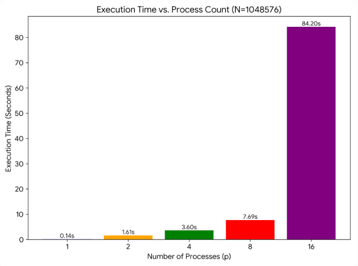
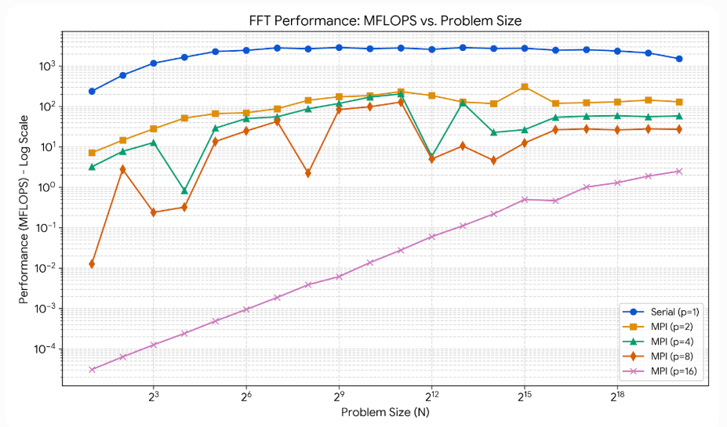
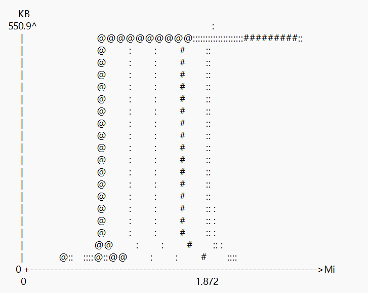

# 中山大学计算机院本科生实验报告

## （2026学年春季学期）

课程名称：并行程序设计         批改人：

| 实验  | 7-MPI并行应用               | 专业（方向） | 计算机科学与技术 |
| ----- | --------------------------- | ------------ | ---------------- |
| 学号  | 22345020                    | 姓名         | 丁烁芝           |
| Email | dingshzh5@mail2.sysu.edu.cn | 完成日期     | 2026/5/20        |

# 1. 实验目的

本实验旨在掌握 MPI 编程模型，针对快速傅里叶变换（FFT）算法的非连续内存访问特征进行并行化改写。通过实践 `MPI_Pack` 和 `MPI_Unpack` 函数，优化分布式内存环境下的消息传递效率。同时，通过改变并行规模（进程数）和问题规模（N），量化分析程序的并行性能瓶颈，并理解通信开销对超算应用加速比的核心影响。

# 2. 实验过程和核心代码

### 2.1 实验环境准备

在 Linux 集群环境下，使用 `mpicxx -O2` 编译 C++ 源码。考虑到并行化后内层循环的全局同步会引入巨大的通信开销，为保证测试在合理时间内完成，动态下调了基础循环次数（`nits`）。测试时，通过 `mpirun -np p` 分别使用 2、4、8、16 个进程提交任务，收集运行时间和 MFLOPS 性能数据。

### 2.2 核心代码实现与优化

由于 FFT 的蝶形运算特性，`step` 函数中各个进程对数组 `c` 和 `d` 的更新是不连续的。直接传递不连续内存会导致高昂的网络碎片开销。实验的核心在于引入**数据打包机制**：

1. **任务划分**：将外层循环 `lj` 按照进程数均匀切分，每个进程只计算局部的数据块。
2. **Pack 聚合**：分配一段连续的 `pack_buffer`，使用 `MPI_Pack` 将分散更新的 `c` 和 `d` 数组局部块打包进连续内存。
3. **全局同步**：利用 `MPI_Allgatherv` 收集所有进程打包好的字节数和数据。
4. **Unpack 还原**：遍历所有进程的任务区间，使用 `MPI_Unpack` 将收集到的连续数据精确写回原始的非连续内存地址。

**核心代码片段：**

```C++
// 准备打包空间
int local_pack_size = actual_lj * mj * 4 * pack_size_per_double;
char* pack_buffer = new char[local_pack_size > 0 ? local_pack_size : 1];
int position = 0;

// 将非连续的 c 和 d 数组块打包
for ( int j = start_j; j < end_j; j++ ) {
    int jc = j * mj2;
    MPI_Pack(&c[jc*2], mj*2, MPI_DOUBLE, pack_buffer, local_pack_size, &position, MPI_COMM_WORLD);
    MPI_Pack(&d[jc*2], mj*2, MPI_DOUBLE, pack_buffer, local_pack_size, &position, MPI_COMM_WORLD); 
}

// 全局广播并解包写回
MPI_Allgatherv(pack_buffer, position, MPI_PACKED, recv_buffer, recvcounts, displs, MPI_PACKED, MPI_COMM_WORLD);

//
```

# 3. 实验结果





根据实验日志，提取最大问题规模 $N = 1048576$ 时的数据进行对比：

- **串行基准**：耗时约 0.138 秒，计算性能达 1519.88 MFLOPS 。  
- **MPI 2进程**：耗时约 1.61 秒，性能骤降至 129.96 MFLOPS 。  
- **MPI 4进程**：耗时约 3.60 秒，性能为 58.22 MFLOPS 。  
- **MPI 8进程**：耗时约 7.69 秒，性能为 27.26 MFLOPS 。  
- **MPI 16进程**：耗时高达 84.2 秒，性能跌至 2.49 MFLOPS 。  

**性能分析**：

实验结果呈现出典型的“负加速”现象。尽管使用了 `MPI_Pack` 优化了内存连续性，但随着进程数 $p$ 的增加，程序运行时间呈指数级上升。这是因为 `step` 函数被嵌套在内层循环中，导致极高频的 `MPI_Allgatherv` 调用。在 $N=1048576$、$p=16$ 时，网络总线需要承受海量的数据广播交集，产生了严重的“通信风暴”。网络 I/O 的延迟与带宽瓶颈彻底淹没了多核带来的计算红利。


通过 Massif 内存分析可见，程序在运行中期的内存占用形成了一条平稳的直线（峰值约 550 KB）。这说明数据打包策略有效复用了 buffer 空间，避免了内存的无序扩张与泄漏。



# 4. 实验感想

这次实验让我深刻体会到了分布式计算中“通信墙”的威力。在测试 $p=16$ 时，由于全量数据广播导致的通信风暴，程序运行异常缓慢，这彻底打破了我此前“核心越多一定越快”的思维定势。我意识到，在系统级开发中，优化非连续内存访问（Pack/Unpack）只是第一步；更重要的是要在算法设计层面尽量减少全局屏障同步（Barrier/Allgather），实现计算与通信的重叠。这是一次充满挫折但也极具启发性的系统调优实战。