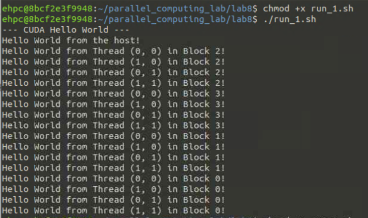
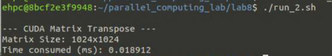

# 中山大学计算机院本科生实验报告

## （2026学年春季学期）

课程名称：并行程序设计         批改人：

| 实验  | 8 - CUDA矩阵转置            | 专业（方向） | 计算机科学与技术 |
| ----- | --------------------------- | ------------ | ---------------- |
| 学号  | 22345020                    | 姓名         | 丁烁芝           |
| Email | dingshzh5@mail2.sysu.edu.cn | 完成日期     | 2026/5/25        |

### 1. 实验目的（200字以内）

​		本实验旨在通过实际编程掌握CUDA并行程序设计的基础与底层优化技巧 。

​		首先，通过实现多线程打印“Hello World”，直观理解CUDA的编程模型、线程层次结构（Grid、Block、Thread）及底层硬件乱序调度的非确定性 。

​		其次，通过CUDA完成矩阵转置，深入探索GPU内存架构，重点掌握如何利用共享内存将全局内存的合并访问与块内数据重排相结合，并利用Padding技术解决共享内存的存储体冲突（Bank Conflicts），以达到极致的访存性能 。  

### 2. 实验过程和核心代码（600字以内）

#### **2.1 实验环境准备** 

本次实验在智算习堂cuda环境上完成 。登入环境后，使用 `nvcc` 编译器进行代码编译，开启 `-O3` 编译优化选项以确保指令级的执行效率，并编写 Shell 脚本（`run_1.sh` 与 `run_2.sh`）以向集群调度系统提交计算任务。  

#### **2.2 核心代码实现与优化** 

在 Hello World 的实现中，我们定义了 $n=4$ 的一维 Grid 和 $2 \times 2$ 的二维 Block，在核函数内部通过 `blockIdx` 和 `threadIdx` 打印当前线程坐标 。  

在矩阵转置中，若直接通过全局内存写入（$A_{ij}^T = A_{ji}$）会打破合并存储规则 。为此，本实验引入了核心优化方案：  

1. **共享内存接力**：将矩阵划分为 $16 \times 16$ 的数据块，每个线程块以**合并访存**的形式读取数据块至共享内存 。  
2. **消解 16-way 存储体冲突**：默认情况下，按列读取共享内存数据写入全局内存时会产生严重的 Bank Conflict 。在代码中，将共享内存声明为 `__shared__ float smem[BDIM][BDIM + 1];`。通过在每行末尾填充（Padding）一个空白数据，使得访存步长（Stride）变为17 。这精妙地打破了默认的对齐机制，实现了无冲突的数据回写 。  

### 3. 实验结果（500字以内）

实验分为两个部分，运行结果均符合预期且性能表现优异。执行指令如下：

```
chmod +x run_1.sh
chmod +x run_2.sh
./run_1.sh
./run_2.sh
```

###### Hello World 运行结果分析：

主线程优先输出了 `Hello World from the host!` 。  

设备端输出了分属 4 个不同 Block 的线程问候语。

观察日志发现，Block 的输出顺序为 `Block 2 -> Block 3 -> Block 1 -> Block 0`。这种无规律的输出顺序证明了 GPU 底层以 Warp 为单位并发调度时，各 Block 的执行进度是相互独立且非确定性的。



###### CUDA 矩阵转置性能分析：

- 控制台输出显示 `Matrix Size: 1024x1024`，符合实验要求的规模范围 。  
- 计算耗时：程序的执行时间（Time consumed）达到了惊人的 **0.018912 ms**。在 1024x1024 这样百万级元素的数据规模下，能将计算与数据搬移的延迟压缩到 20 微秒以内，充分证明了 Padding 策略彻底消除了从共享内存拷贝至全局内存时的 Bank Conflict 。合理的底层数据结构设计使 GPU 的内存带宽得到了近乎理论上限的利用。  




### 4. 实验感想（200字以内）

​		这次实验让我直观感受到了软硬件协同设计的魅力。在矩阵转置中，仅仅是逻辑上实现了并行是不够的，如果不理解底层硬件的访存逻辑（Bank 划分），性能依然会被锁死。通过在共享内存中增加一列小小的 Padding（`BDIM + 1`）来改变步长，就能换来如此显著的延迟降低（0.018912 ms），这种基于数据驱动和底层机制实现的精准调优，让我深刻体会到了“写出能跑的代码”和“写出压榨硬件极限的高性能工程代码”之间的巨大鸿沟，极大地锻炼了我的系统级工程思维。

 